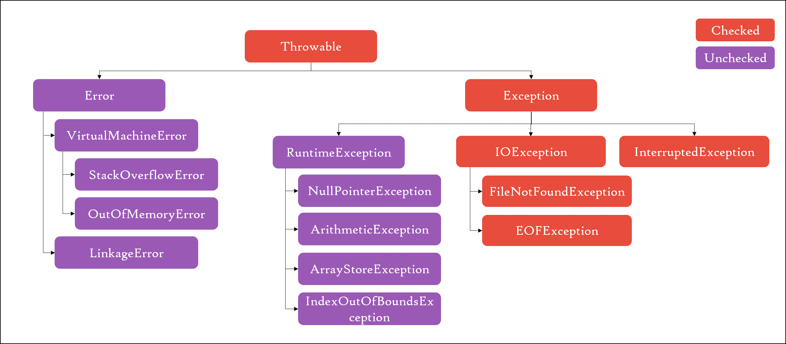

# Session 10

## Table of Contents
1. [Exception Handling](#exceptions)
    1. [The Exception Hierarchy](#hierarchy)
    2. [Checked and Unchecked Exceptions](#checked-unchecked)
    3. [try-catch-finally](#tcf)
    4. [Variants of try-catch-finally](#tcf-variants)
    5. [Some "Exceptional" Cases](#tcf-cases)
2. [Garbage Collection](#gc)
    1. [The Garbage Collector](#gc-core)
    2. [The `finalize` method](#finalize)
3. [Heaps](#heaps)
4. [Assignments](#assignments)
    1. [HackerRank](#hackerrank)
    2. [Miscellaneous](#miscellaneous)

### Exception Handling

The Java programming language uses exceptions to handle errors and other exceptional events.

An exception is an event that occurs during the execution of a program that disrupts the normal flow of instructions.

#### The Exception Hierarchy

All exception and error implementations occur under the Throwable interface in Java.

#### Checked and Unchecked Exceptions

#### try-catch-finally

#### Variants of try-catch-finally

#### Some "Exceptional" Cases

### Garbage Collection

#### The Garbage Collector

#### The `finalize` method

### Heaps

### Assignments

#### HackerRank

#### Miscellaneous
